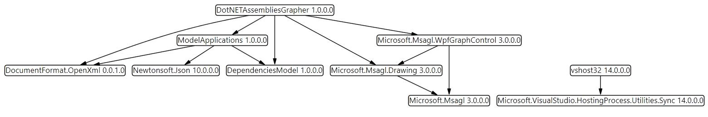
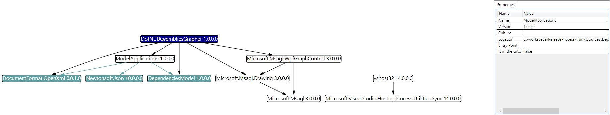
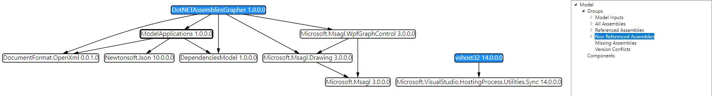
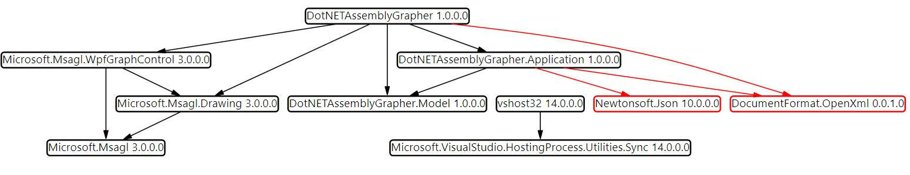
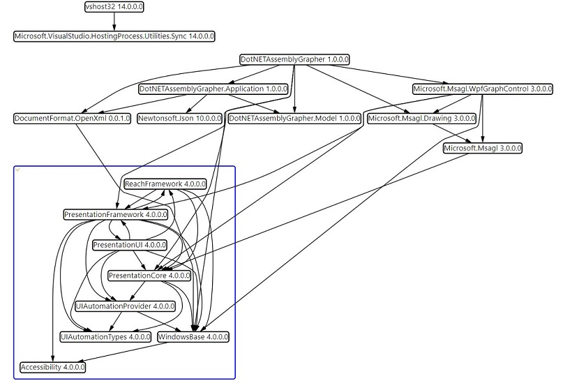
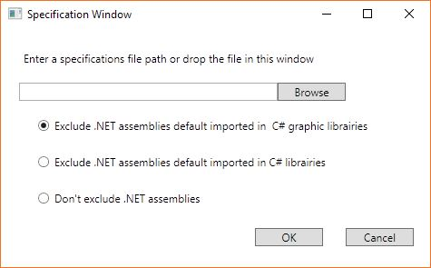
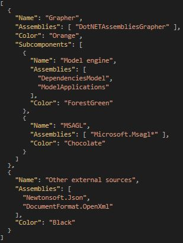
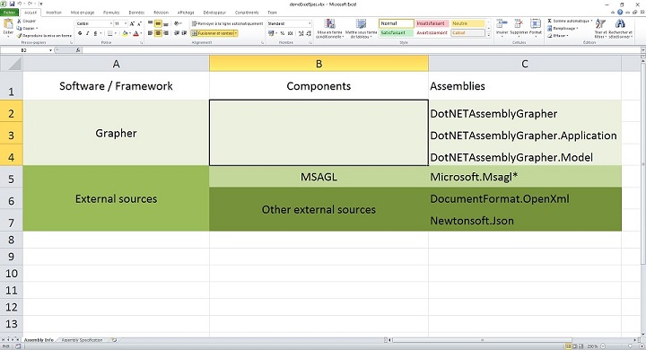
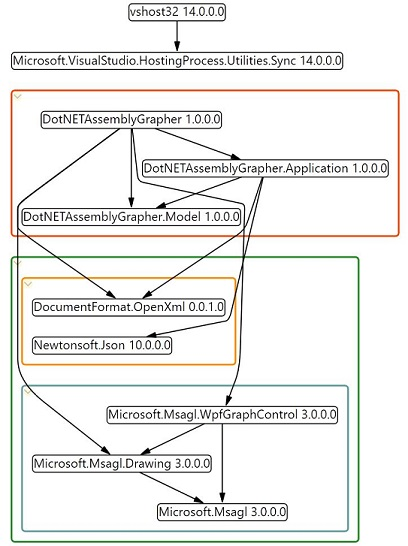
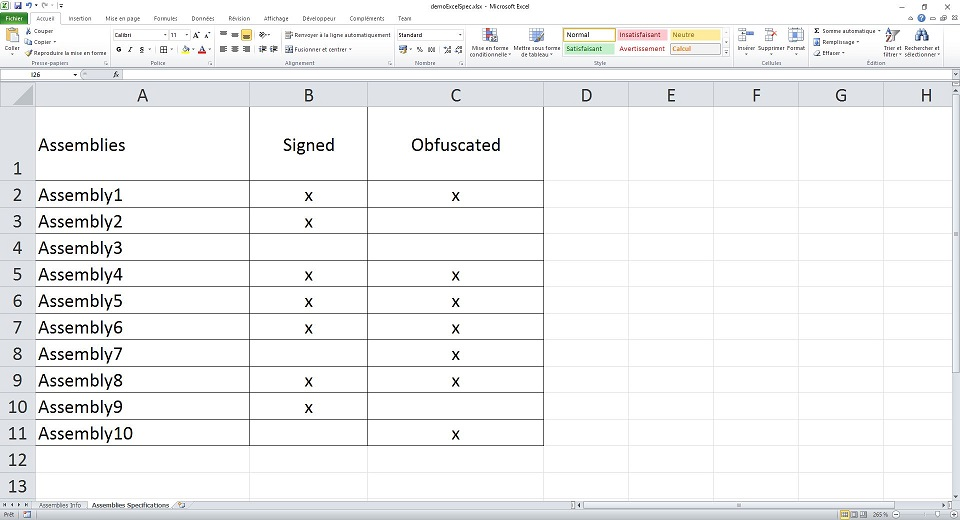

# DotNET Assembly Grapher
DotNET Assembly Grapher is a .NET tool to graph .NET assemblies, their dependencies and add sanity checks.
 
You will find more details about assembly concept on this page: https://msdn.microsoft.com/en-us/library/hk5f40ct(v=vs.90).aspx
 
This software was developed in Agileo Automation.
 
## Getting Started
Open the DotNETAssemblyGrapher.exe.
 
You can choose the directory to analyze in a dialog, by clicking on the *Open* button in the top left corner, or drop it in the window.
 
The directory must at least contain a .dll or a .exe file. The software works only with .NET assemblies.
 
Then you will see a *specification window* appear. In this window you can filter the .NET Framework assemblies with the radio buttons.
More details about specification files are available lower in this page.
 
DotNET Assembly Grapher builds a model of your .NET application and display a graph based on the model:
 

 
#### Graph Handling
 
Nodes can be selected by a mouse click and moved. A node selection will active the *Properties* panel and colore nodes corresponding to referenced assemblies or dependent assemblies.
 

 
A treeview make it possible to browse in the model. A node or a group of nodes selected in the treeview will be highlighted.
 

 
#### Graph Analysis
If DotNET Assemblies Grapher detects some errors in the dependencies, nodes corresponding to the affected assemblies will be colored in red.
 
Main errors are:
- missing assemblies (case represented below)
- alone assemblies (nodes without edges on the graph)
- assembly version conflicts (several versions of an assembly in the model)
 

 
This is the only one case in which red edges are used.
 
Some other troubles can be saw with the TreeView or by watching properties of an assembly in the *Properties* panel.
 
#### .NET Framework Assemblies
If .NET Framework assemblies are displayed on the graph, they will be grouped in a blue subgraph:
 

 
## Using Specification
 

 
By giving a specification file, your application assemblies can be grouped by components, in colored subgraphs (blue is only used for .NET base assemblies).
 
For the moment you can choose between two specification file formats: JSON or Excel.
 
Assemblies with the same base name can be replaced by one regular expression.
 
##### Specification file samples
|               JSON format                  |              Excel Format                    |
| ------------------------------------------ | -------------------------------------------- |
|   |    |
|                                            |                                              |
 
Some rules shall be respected in the Excel Format:
- The sheet must be named "Assembly Info"
- The grid format (on the screenshot) shall be respected (For each component, Assemblies first, then subcomponents)
- Component and subcomponent columns are always under the merged cell "Components"
- You can had subcomponents as long as you respect the grid format
 
Using the JSON format, you can specifie the color, but if the colorname is wrong, a random color will be attributed to the component.
Using the Excel format, you can't specify the color.
 
Result:
 

 
#### Specification for Extra Analyses
DotNET Assembly Grapher also permits to run extra analyses, using specification files in Excel Format.
 

 
For the moment only two extra analyses are implemented:
- Signature analysis
- Obfuscation analysis (may work only with Agileo assemblies)
 
If an analysis is not specified in the file, it will not be run. That gives the possibility to don't run necessarily all analysis.
 
Warning! The sheet containing the analysis specification shall be named "Assembly Specification".
 
## External Sources
 
As represented on the graph screenshots, some external sources are used in this project:
- https://github.com/Microsoft/automatic-graph-layout (To draw the graph and display it in a control view)
- https://github.com/OfficeDev/Open-XML-SDK (To parse Excel specifications files)
- https://github.com/JamesNK/Newtonsoft.Json (To parse JSON specifications files)
